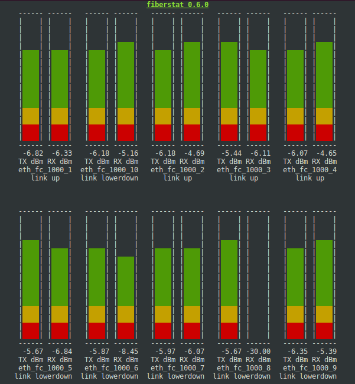

# fiberstat

fiberstat is a small C program that allows monitoring TX/RX power
levels in optic fiber network links.

It relies on the kernel exposing a hwmon entry in sysfs that can
be associated to the network interface, and this program just polls
the power values in mW and shows them in a bar diagram with the
values in dBm.

<p align="center"></p>

## Building

### options and dependencies

The only dependency of the fiberstat program is the ncurses library.

### configure, compile and install

Building for target iMX6 with a generic toolchain:
```
  $ NOCONFIGURE=1 ./autogen.sh
  $ ./configure --host=arm-linux-gnueabihf --prefix=/opt/test
  $ make
  $ sudo make install
```

Building at host forcing test features (e.g. if the host doesn't have
any optic fiber based network interface):
```
  $ NOCONFIGURE=1 ./autogen.sh
  $ ./configure --prefix=/usr CFLAGS="-DFORCE_TEST_SYSFS -DFORCE_TEST_LEVELS"
  $ make
  $ sudo make install
```

## Running

The program may be run just with the defaults, where it will automatically
look for the network interfaces exposing hwmon entries with the specific
power level files for TX and RX:
```
$ fiberstat
```

The program may also be run specifying which explicit interfaces to monitor:
```
$ fiberstat -i eth_fc_1000_1 -i eth_fc_1000_2
```

Or with a polling rate faster than the default of 1Hz; e.g. setting 10Hz
(argument is the period given in ms):
```
$ fiberstat -t 100
```

In order to get colored output on fiberstat when you're running it over a
serial link, you may run it through minicom like this:
```
$ minicom -D /dev/ttyUSB2 --color=on
# TERM=xterm fiberstat
```

## License

This fiberstat program is licensed under the GPLv3+ license.

* Copyright © 2019 Zodiac Inflight Innovations
* Copyright © 2019 Aleksander Morgado <aleksander@aleksander.es>
